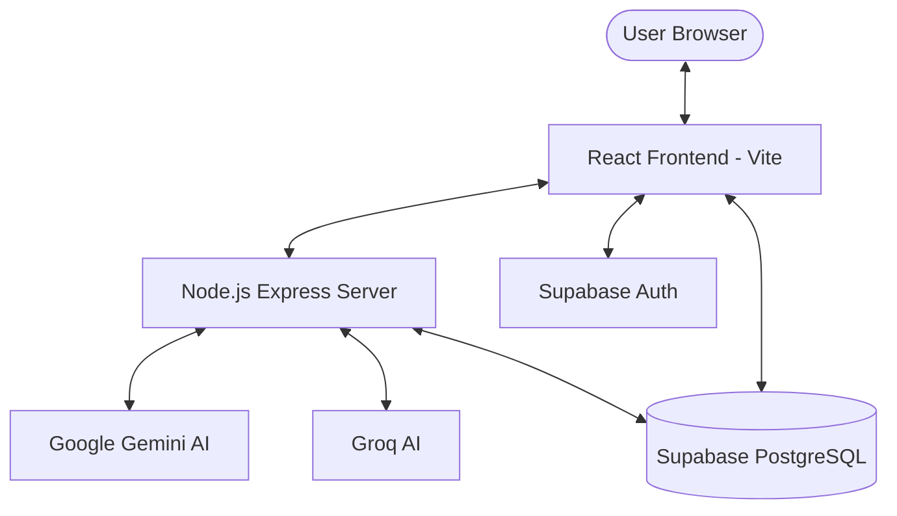

# Digital Notes Organizer (Notes AI) - Full Project Documentation

## 1. Executive Summary
The **Digital Notes Organizer** (also known as **Notes AI**) is a modern, full-stack web application designed to revolutionize personal and professional note management. By leveraging cutting-edge AI technologies (Google Gemini & Groq) and a robust serverless backend (Supabase), the platform offers secure, intelligent, and highly organized note-taking experiences.

---

## 2. Technology Stack

### Frontend
- **Framework**: [React](https://react.dev/) (Vite)
- **Styling**: [Tailwind CSS](https://tailwindcss.com/)
- **Icons**: [Lucide React](https://lucide.dev/)
- **State/Routing**: [React Router](https://reactrouter.com/)
- **Data Visualization**: [D3.js](https://d3js.org/) & [@xyflow/react](https://reactflow.dev/) (for note mapping/graph views)
- **Exports**: [jsPDF](https://github.com/parallax/jsPDF) & [html-docx-js](https://github.com/evidenceprime/html-docx-js)
- **Markdown**: [react-markdown](https://github.com/remarkjs/react-markdown)

### Backend
- **Runtime**: [Node.js](https://nodejs.org/)
- **Framework**: [Express.js](https://expressjs.com/)
- **AI Integration**: [Google Generative AI (Gemini)](https://ai.google.dev/) & [Groq SDK](https://groq.com/)
- **Utils**: [Cheerio](https://cheerio.js.org/) (Scraping), [pdf-parse](https://www.npmjs.com/package/pdf-parse) (Content extraction)
- **Email**: [Nodemailer](https://nodemailer.com/)

### Database & Security
- **Platform**: [Supabase](https://supabase.com/) (PostgreSQL)
- **Auth**: Supabase Auth (JWT-based)
- **Privacy**: Row-Level Security (RLS) policies

---

## 3. System Architecture



---

## 4. Key Features

### 📝 Intelligent Note Management
- **Rich Text/Markdown**: Create and edit notes with full markdown support.
- **Categorization**: Organize notes into Work, Personal, Study, or custom tags.
- **Optimistic UI**: Fast, responsive interactions for CRUD operations.

### 🤖 AI-Powered Capabilities
- **Smart Summarization**: Automatically generate executive summaries of long notes.
- **Content Enhancement**: Improve writing quality or expand on ideas using Gemini/Groq.
- **PDF Extraction**: Upload PDFs and convert them into editable notes using AI parsing.

### 📊 Advanced Visualization
- **Graph View**: Visualize relationships between notes using D3.js and React Flow.
- **Search & Filter**: Real-time filtering by text, tag, or date.

### 📁 Export & Sharing
- **Multi-Format Export**: Save notes as high-quality PDF or Microsoft Word (Docx) files.

### 🔐 Security & Administration
- **User Authentication**: Secure signup/login with Supabase.
- **Data Isolation**: Users only see their own data via RLS.
- **Admin Dashboard**: Specialized interface for managing application health and user metrics.

---

## 5. Project Directory Structure

```text
notes-organizer/
├── client/                 # Frontend React Application
│   ├── src/
│   │   ├── components/     # Reusable UI components
│   │   ├── pages/          # Application views (Dashboard, Login, Admin)
│   │   ├── hooks/          # Custom React hooks (useAuth, etc.)
│   │   ├── lib/            # Configuration (Supabase, API clients)
│   │   └── App.jsx         # Root routing
├── server/                 # Backend Node.js Application
│   ├── controllers/        # Business logic for routes
│   ├── routes/             # API endpoint definitions
│   ├── index.js            # Server entry point
│   └── .env                # App configuration (API keys)
└── project_details.txt     # Overview (Meta-info)
```

---

## 6. Core API Endpoints

| Endpoint | Method | Description |
| :--- | :--- | :--- |
| `/api/auth` | POST | User authentication & registration |
| `/api/notes` | GET/POST/PUT/DELETE | CRUD operations for user notes |
| `/api/ai/process` | POST | Triggers AI summarization/enhancement |
| `/api/ai/parse-pdf` | POST | Extracts text from uploaded files |
| `/api/admin/stats` | GET | Fetches application usage metrics |

---

## 7. Setup & Development

### Prerequisites
- Node.js (v18+)
- Supabase Project (URL & Anon Key)
- Google AI API Key

### Installation
1. **Clone the repository**:
   ```bash
   git clone <repo-url>
   cd notes-organizer
   ```

2. **Backend Setup**:
   ```bash
   cd server
   npm install
   # Add environments to .env:
   # PORT=5000, SUPABASE_URL, SUPABASE_KEY, GEMINI_API_KEY
   npm run dev
   ```

3. **Frontend Setup**:
   ```bash
   cd client
   npm install
   # Configure VITE_SUPABASE_URL and VITE_SUPABASE_ANON_KEY in .env
   npm run dev
   ```

---

## 8. Development Workflow
The project follows a standard PR-based workflow. Every feature should be tested locally using the `npm run dev` environment before deployment. AI features require valid API keys for both Gemini and Groq to function correctly in the production-like local environment.
